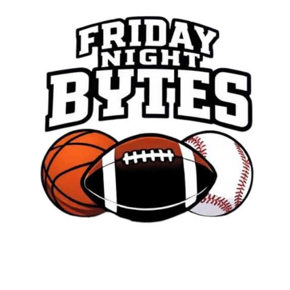

# Friday Night Bytes
"__X's and O's, with no syntax woes!__"

<div align="center">
  
</div>

Friday Night Bytes is a **proof of concept** sports game checker that demonstrates automated data collection using the unofficial ESPN API. This is an educational project that showcases how to build a game-checking application with multiple options of checking games.

## DISCLAIMER
As previously mentioned, this is a public API provided by ESPN, Additionally, I am not affiliated with ESPN nor am I responsible for any usage of this API. This project is solely for educational purposes. Please use this API responsibly and ensure that you are abiding by ESPN's terms of service.

**⚠️ Note on Potential CI/CD Limitations**: Sports data providers actively block automated requests from GitHub Actions and other CI environments. This is expected behavior and demonstrates real-world challenges in web scraping.

_Leagues / Sports currently supported_
- National Basketball Associaton (NBA) :basketball:
- National Footbal League (NFL) :football:
- Major League Baseball :baseball:

## Features
- **Interactive CLI**: Command-line interface for quick team and game checking
- **GUI Application**: User-friendly graphical interface with sport selection and team browsing
- **Multi-sport Support**: NBA, NFL, and MLB game tracking
- **Real-time Data**: Live game schedules and information

## Table of Contents
1. [Getting Started](#Getting-Started)
2. [Running Program](#Running-Program)
   - [GUI Mode](#GUI-Mode)
   - [CLI Mode](#CLI-Mode)
3. [Pushover](#Pushover)

## Getting Started
To get started, run the following commands in the root of the project:

```
python3 -m venv env
source env/bin/activate
pip3 install -r required_libraries.txt
```

## Running Program
To run the program, you have three options: GUI mode, interactive CLI, or command line arguments.

### GUI Mode
Launch the graphical user interface: `python3 main.py --gui`
Or run the GUI directly: `python3 gui/gui_app.py`

The GUI provides:
- **Splash Screen**: Welcome screen with logo
- **Sport Selection**: Click on the NFL, NBA or MLB logo
- **Team Selection**: Browse and select your favorite teams
- **Game Display**: View upcoming games for your selected teams

### CLI Mode
```
python3 main.py
```

See the usage for the CLI below:
```
$ python3 main.py -h
usage: main.py [-h] [--sport SPORT] [--nba-teams NBA_TEAMS] [--nfl-teams NFL_TEAMS] [--mlb-teams MLB_TEAMS] [--gui]

Friday Night Bytes CLI

options:
  -h, --help            show this help message and exit
  --sport SPORT, -s SPORT
                        Favorite sport number (i.e. 1 for NBA, 2 for NFL, 3 for MLB)
  --nba-teams NBA_TEAMS
                        Comma-separated NBA team abbreviations (i.e. lal,bos,mia)
  --nfl-teams NFL_TEAMS
                        Comma-separated NFL team abbreviations (i.e. phi,kc,sf)
  --mlb-teams MLB_TEAMS
                        Comma-separated MLB team abbreviations (i.e. lad, nyy, bos)
  --gui                 Launch the GUI version
```

## Pushover
Additionally, support for the Pushover app is available as well! To get started, create an `.env` file that contains the following:

```
PUSHOVER_USER_KEY   = ""
PUSHOVER_API_TOKEN  = ""
```

Once done, utilize the CLI option to get updates to your mobile device of your favorite teams!